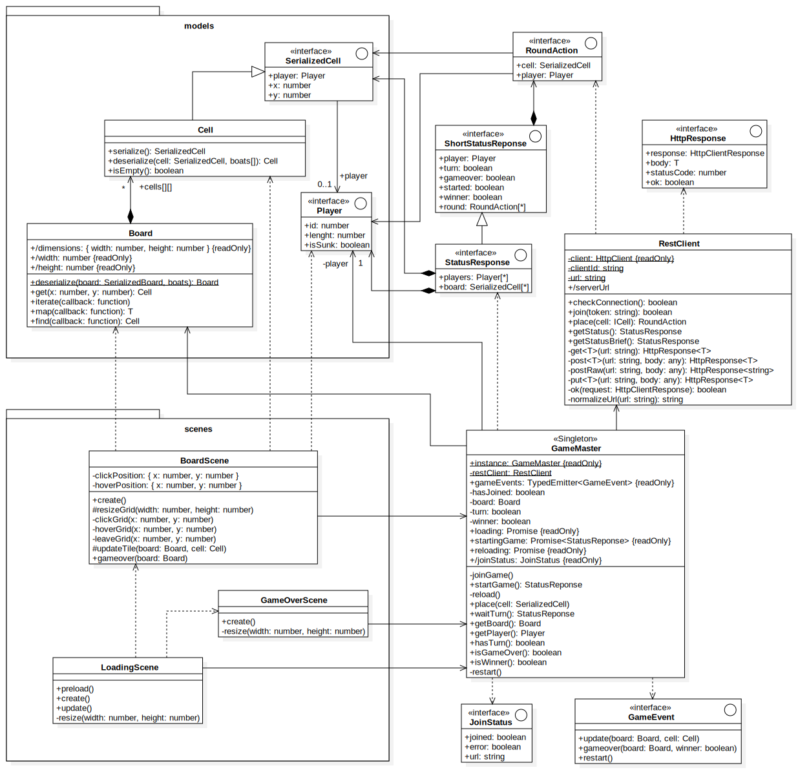
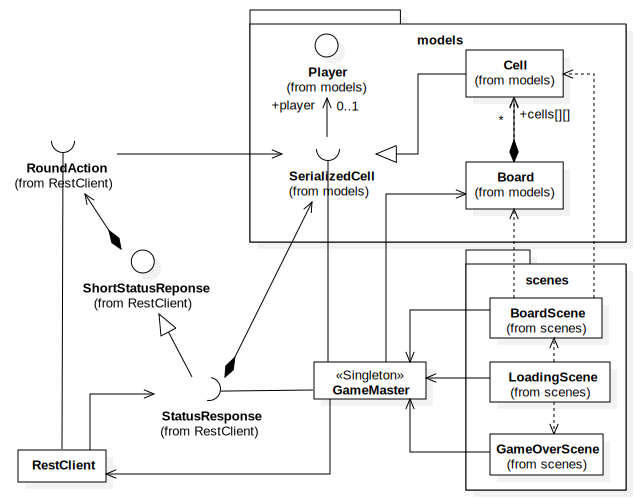
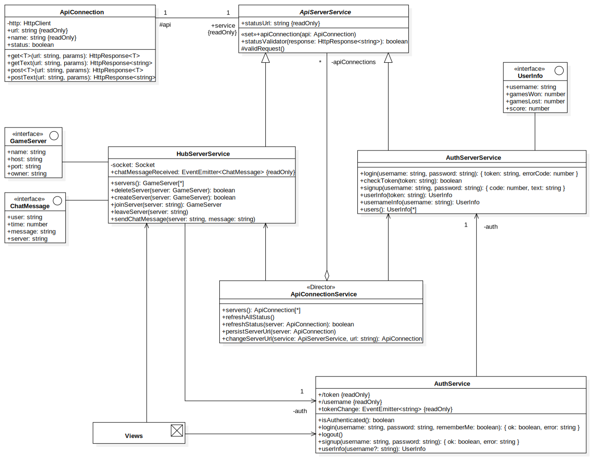

# Arquitectura y Diseño

El diseño que sigue el código de la practica tiene una separación lógica entre Cliente y Servidor.

* [Servidor](#servidor)
* [Cliente de juego](#cliente-de-juego)
* [Cliente web](#cliente-web)

## Servidor

El servidor se basa en la arquitectura de los servicios hub y auth-server, es una api python con flask.

La estructura principal de los modelos esta basada en el patrón fábrica abstracta. Con el objetivo de mejorar el extensibilidad del servidor (principio de abierto/cerrado).
Para crear un nuevo juego, solo es necesario añadir tres clases nuevas que heredan de:

* AbstractGameMaster, el árbitro del juego, se deben definir los métodos de post-colocar-ficha, obtener puntuación y calcular ganador.
* AbstractBoard, contiene la información de las celdas.
* AbstractFactory, el constructor del tablero y del árbitro.

La lógica de la api y flujo del juego es independiente del GameMaster que se haya elegido (principio de sustitución de Liskov). Por lo que se podría cambiar el GameMaster en tiempo de ejecución sin repercusiones (siempre que el juego no esté en progreso). Con esto tambien se cumple el principio de inversión de dependencia.

Además se han creado dos nuevas clases con respecto a la entrega anterior, basandonos en el principio de responsabilidad única:

* PlayerManager, se encarga de mantener un listado de los usuarios, su identificador y otra información relacionada con el conjunto de jugadores. Anteriormente esta lógica estaba dentro del GameMaster.
* RoundAction, almacena información sobre las acciones tomadas en cada turno por cada jugador para posteriormente ser enviadas a los clientes. La lógica antes estaba en GameMaster y Player.

Las clases de la carpeta `models` se reparten en tres paquetes:

* `shared`: Todos las clases que se utilizan en todos los juegos.
* `go`: Únicamente las clases que son utilizadas en el juego de Go.
* `tictactoe`: Únicamente las clases que son utilizadas en el juego de Tic Tac Toe.

La selección del juego la realiza la fachada de la api, cuando se inicializa comprueba las variables de entrono y selecciona el AbstractFactory correspondiente. Por lo que no interactua directamente con la creación del tablero ni árbitro.

Otro patrón que se usan fuera de los modelos es fachada para RestApi.

En lugar de crear una clase para las piezas, hemos decidido utilizar un único atributo de tipo `Player` en `Cell` que índica si hay o no una pieza y de que jugador es. Es discutible si esto viola el principio de responsabilidad única, pero es indudable que simplifica mucho la implementación tanto del servidor como la del cliente.

## Cliente de juego

El cliente de juego está hecho en TypeScript y los gráficos se generan por medio de la libreria Phaser.

Se pueden diferenciar tres paquetes o subconjuntos de clases: los modelos, las escenas, y el control.

Los modelos son las clases que componen el juego: tablero, jugadores, y celdas.

Las escenas son la parte gráfica del programa, tanto la visualización como la interacción con el usuario.

En el control tenemos tanto un árbitro que controla el flujo del juego, y un cliente http para poder contectarse con el servidor de juego.

De forma resumida, la estructura del cliente es la siguiente:

El GameMaster aplica el patrón singleton ya que solo puede haber un único flujo del juego. A diferencia de la entrega anterior, el GameMaster puede reinstanciarse durante el juego, este es el caso de reinicar la partida una vez haya acabado.

Hemos quitado muchas clases de los tres paquetes que no eran necesarias y violaban el principio de inversión de dependencia.

## Cliente web

El cliente web está programado en TypeScript utilizando el framework Angular.

Esta interfaz web sirve como un enlance entre todas las APIs y el propio cliente de juego.
De tal manera que desde esta plataforma se realizan las acciones previas a jugar (registrarse, login, registart servidor, unirse, consultar puntuaciones).

Las clases de componentes (views) están estructuradas según su ruta http, este es el estandard que se sigue en Angular, aunque compartan gran cantidad de código la herencia de componentes es muy complicada y crea más problemas de los que soluciona:

* [https://angular.io/guide/file-structure](https://angular.io/guide/file-structure)
* [https://medium.com/@motcowley/angular-folder-structure-d1809be95542](https://medium.com/@motcowley/angular-folder-structure-d1809be95542)

No se ha realizado ningun cambio de este cliente respecto la entrega anterior.

Otra idiosincrasia que tiene el diseño es donde se establece el valor de `api: ApiConnection` de cada ApiServerService:

* No puede ser en cada instance de ApiServerService ya que habría código duplicado y podría violarse el principio de sustitución de Liskov.
* Tampoco puede hacerse en la clase `ApiServerService`, ya que estas conexiones deben de poder modificarse en el futuro, por lo que `ApiServerService` debería de tener métodos para modificar estas, lo cual violaría el principio de responsabilidad única.
* La asignación se hace en un servicio independiente llamado `ApiConnectionService`, que se encarga de crear y editar las conexiones de todas las APIs.
