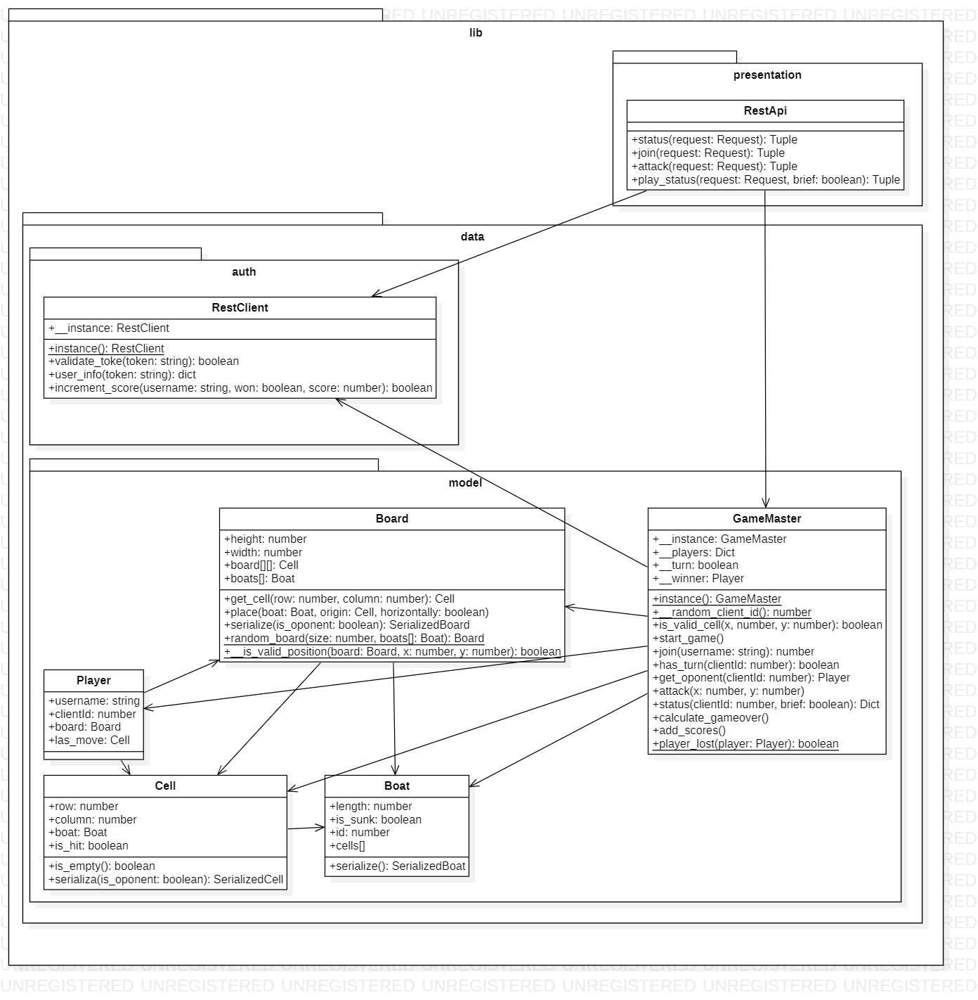

# Arquitectura y Diseño
El diseño que sigue el código de la practica tiene una separación lógica entre Cliente y Servidor.

## Servidor

### Player
Esta clase sirve para crear el objeto que representa a cada jugador. Cada jugador tiene un usuario (username), un id de cliente (clientId), un tablero asociado (board) y la celda correspondiente al último movimiento realizado (last_move). 

### Boat
La clase Boat es usada para instanciar objetos que representan a los barcos del tablero de cada jugador. Cada barco tiene una longitud/tamaño (length), una variable (is_sunk) que determina si el barco está hundido o no, un identificador (id) y el conjunto de celdas en el que se encuentra (cells[]).

### Cell
Clase encargada de crear el objeto que representa a cada celda de los tableros. Cada celda se encuentra en las coordenadas dadas por una fila (row) y columna(columna), tiene una variable (is_hit) que determina si ha sido atacada por el otro jugador y puede tener un barco (boat). Con el método is_empty() se comprueba si la celda contiene o no a algún barco.

### Board
Esta clase sirve para poder instanciar un tablero. Los tableros son cuadrados por lo que la altura (height) y el ancho (witdth) tendrán el mismo valor, en la variable board se almacena la una matriz de tamaño NxN de celdas y en la variable boats se almacena una lista de barcos con los barcos que contiene el tablero.
Contiene los siguientes métodos:

* Get_cell(row,column): Sirve para obtener la celda que se encuentra en las coordenadas dadas por row y column.
* Place(boat, cell, horizontally): Sirve para colocar un barco (boat) en la celda (cell) de forma horizontal o vertical (horizontally:true-false).
* Random_board(size, boats): Sirve para colocar de forma aleatoria los diferentes barcos en el tablero.
* __is_valid_position(board, x, y): Sirve para comprobar si la posición en la que se va colocar un barco es válida, es decir, si hay espacio para poder colocar el barco sin que este ocupe alguna de las celdas ya usadas.

### GameMaster
La clase GameMaster se usa para instanciar un objeto que representa la partida. La instancia de GameMaster encapsula una instancia de sí mismo usada para comprobar que solo exista una única instancia de GameMaster basándonos en el patrón creacional Singleton y se garantice que solo haya una única instancia de GameMaster, es decir, una sola partida en el servidor. También contiene un diccionario con los jugadores (__players), un turno (__turn), y un ganador (__winner).
Los métodos de la clase son:
* Instance(): Como hemos explicado, usamos el patrón creacional Singleton por lo que aseguramos que solo hay una instancia de GameMaster, que es de lo que se encarga este método estático. Devuelve GameMaster.__instance.
* __random_client_id(): Genera y devuleve un id aleatorio para un cliente.
*	Id_valid_cell(x,y): Sirve para comprobar que la celda correspondiente a las coordenadas x e y está dentro del tablero.
*	Start_game(): Este método inicializa la partida, creando los tableros para los 2 jugadores y estableciendo el turno de juego.
*	Join(username): Añade un jugador a la partida, establece su id y en caso de que ya estén los 2 jugadores inicia la partida.
*	Is_player(clientId): Comprueba que el id del usuario no sea None y que esté registrado en __players.
*	Has_turn(clientId): Comprueba si es el turno del usuario o no.
*	Get_oponent(clientId): Obtiene el oponente del jugador correspondiente al id que recibe.
*	Attack(x,y): Primero comprueba que la partida este iniciada, si la partida si está iniciada marca la celda del contrario con la variable is_hit y en caso de que la celda fuese la última que queda de uno de los barcos lo marca como hundido con is_sunk. Después cambia el turno y comprueba si la partida ha terminado.  
* Status(clientId, brief): Comprueba, actualiza y devuelve el estado de la partida. Usando el patrón de comportamiento Estado, dependiendo del estado de las partidas se pueden realizar unas acciones u otras. En caso de que la partida no se haya iniciado, obviamente todavía no se puede jugar, modificar marcadores, etc. Si el estado de la partida es terminado, se establece un ganador y en caso contrario no se pude. Dependiendo del turno podrá atacar uno de los 2 jugadores.
*	Calculate_gameover(): Comprueba si la partida ha terminado y en caso de que haya terminado establece al ganador de la partida.
*	Add_scores(): Añade la puntuación de cada jugador.
*	Player_lost(player): Comprueba si el jugador (player) tiene celdas con barcos sin haber sido atacadas. Si no le quedan celdas el jugador ha perdido.

### RestClient
Esta clase sirve como interfaz para el servidor de autenticación, implementa el patron creacional Singleton. Usando instace() comprobamos que no exista una instancia previa para asegurar que exista una única instancia de la clase. Con el método validate_token(token) se encarga de validar de token en el servidor de autenticación devolviendo True si este corresponde a una sesión válida. El método user_info(token) comprueba que el token sea valido y devuelve la información del usuario correspondiente. Finalmente, increment_score(username, won, score) se encarga de realizar el incremento de la puntuación en el servidor de autenticación devolviendo True en caso de que la operación se realice correctamente.

### RestApi
Basándonos en el patrón estructural Fachada, esta clase sirve, como el patrón indica, de fachada para realizar las operaciones que nos da el Rest Api. El método status(request) devuelve siempre una tupla (200,”OK”), el método join(request) se encarga de añadir un usuario y obtener el id de cliente, además comprueba que token y user_info no estén vacíos , que se puedan añadir nuevos jugadores y devuelve la tupla (200, clientId). El método attack(request) comprueba que se pueda realizar el ataque dependiendo del estado de la partida, que los usuarios sean válidos y el jugador atacante tenga turno así como que la coordenadas en las que se realiza el ataque sean correctas. Finalmente, play_status(request, brief) devuelve el estado de la partida.

## Cliente

En el paquete Model nos encontramos con las siguientes interfaces:
IBoard, SerializedBoard que extiende de IBoard, Icell y SerializedCell que extiende de ICell, y las siguientes clases:

### Board que implementa la interfaz IBoard
* dimensions(width, height): recibe como parámetros una anchura y una altura y devuelve la dimensión del tablero.
* Width(): devuelve la anchura del tablero.
* Height(): devuelve la altura del tablero.
* Get(): recibe como parámetros una coordenada y devuelve la celda correspondiente del tablero.
* Iterate(callback): recibe como parámetro un función y se encargará de recorrer todas las celdas del tablero
* Map(callback): recibe como parámetro una función y devuelve una matriz con todas las celdas que se encuentren dentro del rango especificado por x e y.
* Find(callback): devuelve una celda si esta se encuentra en el tablero o null en caso contrario.

### Boat
Clase que sirve para intanciar un objeto de tipo Boat que recibe en su constructor un identificador, una longitud y un booleano que determina si el barco está hundido.

### Cell Cell que implementa la interfaz ICell
Recibe en su contructor los siguientes parámetros.
* x -> fila
* y-> columna
* isVisible -> determina si esa celda es visible al oponente.
* isHit -> determina si el barco ha sido tocado.
* Boat -> un barco.
Consta de los siguientes métodos.
* Serialize(): devuelve una celda con la información correspondiente a la fila, la columna y el id.

### AttackScene que extiende  de Scene
Consta de los siguientes métodos:
* create(): crea la escena inicial de la partida.
* resizeGrid(width, height): reescala el tamaño del tablero
* hoverGrid(x,y): 
* leaveGrid(x,y):

### DefendScene que extiende de Scene
Consta de los siguientes métodos:
* create(): crea la escena inicial de la partida.
* resizeGrid(width, height): reescala el tamaño del tablero
* revealTitle(cell): revela la celda en caso de que en dicha celda haya un barco y además esté hundido

### GameOverScene que extiende de Scene
Consta de los siguientes métodos:
* create(): crea la escena inicial de la partida.
* resizeGrid(width, height): reescala el tamaño del tablero

### LoadingScene que extiende de Scene
Consta de los siguientes métodos:
* create(): crea la escena inicial de la partida.
* resizeGrid(width, height): reescala el tamaño del tablero

### GameMaster
Clase que una permitirá el desarrollo de la partida, tiene un constructor sin parámetros que se encargará de cargar la partida e iniciarla.
Consta de los siguientes métodos:
* joinGame(): Permite al jugador introducirse en la partida.
* startGame(): empieza la partida.
* Reload(): reinicia la partida.
* Attack(cell): permite atacar una celda en la que hay un barco
* waitTurn(): espera el turno del oponente, una vez realizado el movimiento.
* getSelfBoard(): devuelve el tablero en el que se desarrolla la partida.
* getOponenteBoard(): devuelve le tablero del oponente.
* hasTurn(): determina cual de los 2 jugadores tiene el turno.
* isGameOver(): determina si la partida ha acabado.
* isWinner(): determina si el jugador ha ganado la partida.
* joinStatus(): devuelve el estado de la partida.

### RestClient
Se trata de la clase que permitirá conectar la repuesta del cliente con la del servidor.
Consta de los siguientes métodos:
* setUrl(url): establece la url del servidor.
* serverUrl(): devuelve la url del servidor.
* checkConnection(): chequea si la conexión está correctamente.

