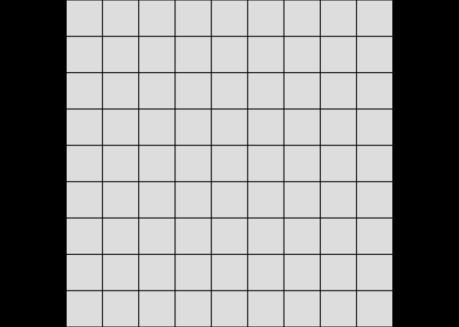
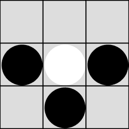

# Documentacion de uso

* [Ejecutar servicios](#ejecutar-servicios)
* [Cambiar url de los servicios](#Cambiar-url-de-los-servicios)
* [Login y registro](#Login-y-registro)
* [Navegación](#navegación)
* [Lista de servidores](#lista-de-servidores)
  * [Mis servidores](#mis-servidores)
  * [Servidores públicos](#servidores-públicos)
  * [Conectarse a un servidor](#Conectarse-a-un-servidor)
* [Juego](#Juego)
  * [Estados de conexión](#estados-de-conexión)
  * [Cómo jugar](#Cómo-jugar)
  * [Go](#Go)
  * [Tic Tac Toe](#Tic-Tac-Toe)
* [Mi cuenta](#mi-cuenta)
* [Rankings](#rankings)

## Ejecutar servicios

Acceder a la página web, ya sea en local por medio de `npm start` o por url de un cliente alojado en un servidor.

Para un correcto funcionamiento de la página web se requiere tener encendidos los servicios `hub` y `auth-server`.

Puede ejecutarse en local o se puede configurar el cliente para que utilice estos servicios de una url específica, veremos como en el siguiente apartado.

Por defecto se asume que estos servicios se encuentran en `http://localhost:4444` y `http://localhost:1234` respectivamente.

## Cambiar url de los servicios

En la esquina inferior de la web se encuentra un botón debug, al pulsar se mostrarán todos los servicios, su estado y url.

Pulsado sobre editar en el servicio correpondiente abre una ventana que permite editar la url del servicio.

La opción `Always use this address` indica que se guardara en cache está url y en posteriores accesos se utilizará automaticamente la nueva url.

En caso de que un servicio no funcione o no esté disponible, se mostrará un indicador rojo.

## Login y registro

Para acceder a cualquier parte del cliente se requiere haber hecho login, en caso negativo se redirige automáticamente al login.

La opción `Remember me` guarda en cache el usuario actual y no pedirá login hasta que caduque la sesión.

Una vez hecho login redirije a la página principal.

En caso de no tener usuario creado, entrar en `Sign up` y crear una nueva cuenta.

## Navegación

En la barra superior de nvegación se muestran las diferentes ventanas a las que se puede acceder.
También contiene un botón en la parte derecha para cerrar sesión.

## Lista de servidores

En esta ventana se muestran todos los servidores que están registrados en el hub.

### Mis servidores

En este apartado se muestran todos los servidores registrados por el usuario.

Para registrar uno nuevo, pulsar en el botón `Create new server`. Se abre una nueva ventana, se debe introducir un nombre, el host y el puerto del servidor de juego.

Una vez creado se puede eliminar y editar su host y puerto.

### Servidores públicos

En este apartado se muestran los servidores creados por otros usuarios.

### Conectarse a un servidor

Para acceder al juego de un servidor, simplemente es necesario hacer click sobre uno de los servidores de la lista, ya sea de mis servidores o públicos. Esto nos lleva a la ventana de juego.

## Juego

Al conectarse con un servidor se muestra esta ventana, en la parte izquierda se ve el cliente de juego y a la derecha un chat.

### Estados de conexión

* Conectando, como vemos en la imagen anterior, se esta conectando con el servidor de juego.
* Error de conexión, no ha sido posible conectarse con el servidor por cualquier motivo.

* Esperando a otros jugadores, el juego requiere que se conecten más jugadores antes de poder empezar.

* Juego comenzado, la partida ha comenzado.

### Cómo jugar

El juego se desarrolla sobre un tablero.

Cada jugador tiene piezas de un color, los jugadores se intercambian progresivamente el turno hasta que el juego sea ganado (o perdido).

#### Contenido

Cada celda puede tener una ficha, de izquierda a derecha representa:

* No tiene ficha.
* Al hacer click se colocará una ficha en esta posición (depende del color del jugador).
* Ficha colocada blanca.
* Ficha colocada negra.

#### Cursor

* , hacer click no va a realizar ninguna acción.
* , atacar la coordenada seleccionada.
* , se puede atacar esta coordenada pero el jugador debe esperar su turno.

Cuando se ataca una coordenada, se revela si había o no un barco y si el barco se ha hundido. A continuación se cambia el turno.

La partida irá progresando y se acrualizará y sus celdas.

Cuando la condición de victoria se cumpla, se acaba la partida y se muestra la siguiente ventana:

El servidor de juego se reinicia de nuevo a los 10 segundos de haber acabado la partida.
El juego vuelve a conectarse automáticamente.

El jugador recibe puntuación según el resultado del juego.

### Go

En esta versión simplificada de Go, cada jugador coloca una ficha por turno, si la ficha está completamente rodeada de fichas del enemigo, se captura (elimina) esta ficha.

La partida acaba al final del turno 8, y gana el jugador que tenga más fichas en el tablero (o aleatorio en caso de que el número sea igual).

La puntuación ganada es el número de fichas que tenega el jugador.

### Tic Tac Toe

El juego es tres en raya, aunque se puede configurar para tener el tablero de las dimensiones que se quiera y tantas fichas seguidas requeridas para ganar como se quiera.

Se acaba la partiada cuando hay tres fichas seguidas (horizontalmente, verticalemente, o diagonalmente) de un mismo jugador que es el que gana. Se produce un empate si la previa condición no se cumple y todas las celdas del tablero están llenas.

La puntuación ganada es 0 si no gana, y 3 (el número de fichas seguidas) para el que gane.

## Mi cuenta

En esta ventana podemos ver estadisticas sobre la puntuación y las partidas ganas y perdidas.

## Rankings

En esta ventana se muestra el listado de todos los usuarios y su ranking según su puntuación. Haciendo click sobre cualquier fila nos lleva a una ventana de detalle similar a la de mi cuenta.

